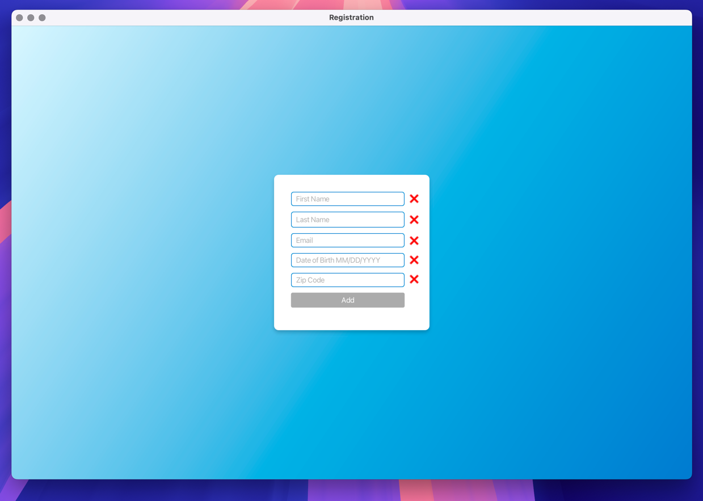
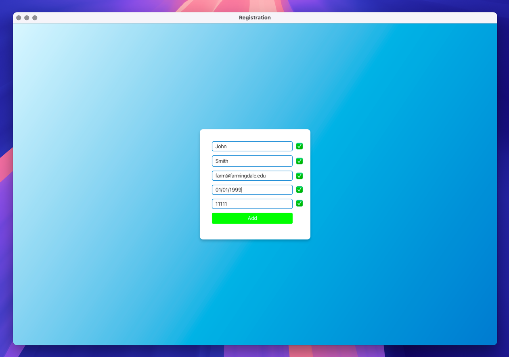

<h1 align="center">Regular Expression Assignment</h1>

## 📚 Table of Contents
- [🚀 Features](#-features)
- [🧰 Tech Stack](#-tech-stack-and-libraries)
- [📝 License](#-license)

## 🚀 Features
- JavaFX registration form
- Text boxes for 
  - First Name
  - Last Name
  - Date of Birth
  - Zip Code
- Input Validation Using Regex
- Informs the user of the validity when they click on a different text box
- "Add" button is only enabled when all fields contain valid data
- "Add" button changes color when all fields contain valid data
- Clean and modern User Interface
- JavaDoc Style documentation

## 🧰 Tech Stack and Libraries

## 📝 License
This project uses the MIT License. 